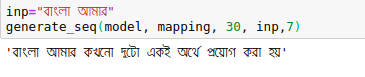

<h2>Bangla Text Generator in Word Level</h2>
<p>This project generates certain level of Bangla word based on a given number and some Bangla words as a context value. 
To make it workable, a Recurrent Neural Network Model is trained on Bangla Wiki corpus and it achieves a satisfactory 
level performance. </p>

## Dependecies
1. This project is tested on CPU Core i5 (6th Gen), 8 GB RAM
2. Tensorflow 1.13.1
3. Python 3.6.7
4. Keras 2.2.4 

## Requirements 
Install requirements packages by running the following command <br>
```pip install -r requirments.txt```

## Data-Set
Keep Bangla wiki corpus data into data forlder. 
## Results
This model predicts next 7 Bangla words after giving input "বাংলা আমার" into the model.<br> <br>


